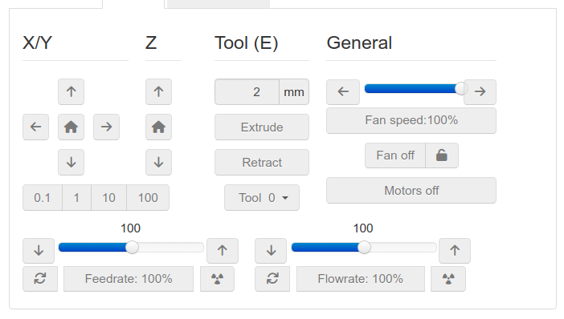
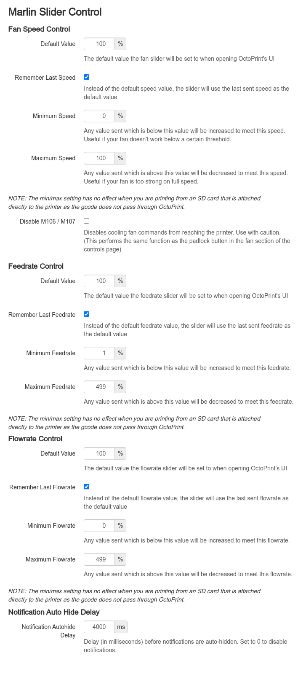

# Marlin Slider Controls

Originally created by CmdrCody51 (GitHub), this is a fork just to have the plugin available again for the community.

Adds sliders to the controls page for setting the speed of your fans, feedrate and flowrate.
With a settings page that allows limiting the fan's output power and min/max feedrates and flowrates.

**NOTE:** When you are printing from an SD card that is attached directly to the printer, NONE of this works as the gcode does not pass through OctoPrint.
